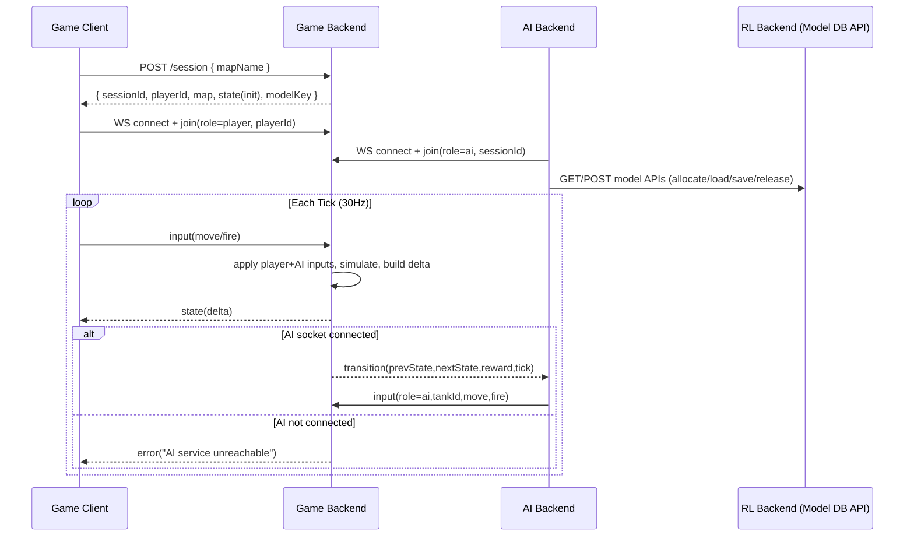

# Tank Arena

An HTML5 tank arena game built with vanilla JavaScript. Control your tank, shoot enemies, and survive as long as possible!

## Features

- **Smooth Game Loop**: Fixed timestep game loop for consistent gameplay
- **Tank Controls**: WASD or Arrow keys for movement, mouse for aiming
- **Enemy AI**: Enemies spawn and chase the player
- **Combat System**: Shoot bullets to defeat enemies
- **Health System**: Take damage from enemy collisions
- **Score System**: Earn points by defeating enemies
- **Modern UI**: Clean interface with start and game over screens

## How to Play

1. Start the game server (see "Local Dev Server")
2. Open `http://127.0.0.1:5173` in a web browser
3. Click "Start Game"
4. Use **WASD** or **Arrow Keys** to move your tank
5. Use **Mouse** to aim
6. **Left Click** to shoot
7. Survive as long as possible and defeat enemies!

## Game Mechanics

- **Movement**: Tank moves in 8 directions based on input
- **Aiming**: Tank turret always faces the mouse cursor
- **Shooting**: Click to fire bullets (cooldown: 0.3 seconds)
- **Enemies**: Spawn from edges and chase the player
- **Damage**: Colliding with enemies deals damage over time
- **Scoring**: Defeat enemies to earn 100 points each

## Project Structure

```
Tank Arena/
├── start-dev.bat        # Start backend + game server (Windows)
├── index.html          # Main HTML file
├── css/
│   └── style.css       # Game styling
├── js/
│   ├── game.js         # Main game loop and game logic
│   ├── tank.js         # Tank and bullet entities
│   └── input.js        # Input handling
├── DeepRL/
│   └── backend/
│       └── server.py   # Local backend DB for RL
└── README.md           # This file
```

## Local Dev Server

The game uses a local server plus the DeepRL backend for persistence.

### Windows (batch)

```

Install Game Backend dependencies once:

```
python -m pip install -r scripts/game-backend-requirements.txt
python -m pip install -r DeepRL/ai-backend/requirements.txt
python -m pip install -r DeepRL/backend/requirements.txt
```
start-dev.bat
This starts:
- RL Backend: `http://127.0.0.1:5050`
- Game Backend: `http://127.0.0.1:5051`
- Game: `http://127.0.0.1:5173`

The startup scripts also:
- set `config/deploy.profile.json` to `{"profile":"local"}`
- generate `js/runtime-config.js` from the active deploy config

## Runtime Architecture

### Component Roles

- **Game Client** (`index.html` + `js/*`)
  - Render-only + input relay in online mode.
  - Sends player control events to Game Backend via WebSocket.
  - Receives authoritative delta state from Game Backend and renders it.

- **GBE (Game Backend)** (`scripts/game-backend.py`)
  - Authoritative game simulation loop (30Hz), sessions, collision, bullets, spawn, game-over.
  - Owns all authoritative entities and state transitions.
  - Broadcasts delta state to all game clients in the same session.
  - Sends transitions to AI Backend when AI socket is connected.

- **AI Backend** (`DeepRL/ai-backend/server.py`)
  - The unique runtime `role=ai` peer connected to GBE session sockets.
  - Consumes transitions from GBE, performs training/action generation, and sends AI inputs back to GBE.
  - Reads/writes model instances through RL Backend HTTP APIs.

- **RL Backend** (`DeepRL/backend/server.py`)
  - Model persistence and allocation service around `rl-models.db`.
  - Provides model load/save/allocate/release APIs for AI Backend.
  - Does **not** connect to GBE as an AI runtime client.

### Game Backend API (v1)

- `POST /session` → create session
- `POST /session/:id/join` → join session
- `POST /session/:id/ai-input` → submit AI move events (AI backend push)
- WebSocket `ws://127.0.0.1:5051/ws?sessionId=...` for state + inputs

## Revised Message Flow



### Connection Initialization + Determination

- AI Backend is the only service that should join GBE as `role=ai`.
- RL Backend should remain DB/API only and must not open AI role sockets to GBE.
- If AI socket is not connected, GBE marks AI connection error in debug and continues session loop without AI actions.

### Deployment Config Files (Source of Truth)

- `config/deploy.profile.json` chooses active profile:
  - `{"profile":"local"}`
  - `{"profile":"render"}`
- `config/deploy.local.json` contains local URLs/host/port/path values.
- `config/deploy.render.json` contains Render URLs/host/port/path values.
- URL/path settings are loaded from config files by:
  - `scripts/game-backend.py`
  - `DeepRL/ai-backend/server.py`
  - `DeepRL/backend/server.py`
- Frontend endpoint settings are generated into `js/runtime-config.js` by:
  - `python scripts/generate_runtime_config.py`

### Health Endpoints

- Game Backend: `GET /healthz`
- RL Backend: `GET /healthz`

## Render Deployment (Code Already Implemented)

1. Set Render profile values in `config/deploy.render.json`.
2. Create services from `render.yaml` using **New + Blueprint**.
3. Attach RL persistent disk at `/var/data`.
4. Deploy all services.
5. Verify health:
   - `https://<gbe-public-url>/healthz`
   - RL `/healthz` via temporary public exposure or internal log verification.
6. Verify gameplay:
   - Create/join session in public client URL.
   - Confirm AI joins and returns actions.
7. Verify persistence:
   - Restart RL service and confirm model DB persists at `/var/data/rl-models.db`.

## Technical Details

- **Canvas Size**: 800x600 pixels
- **Frame Rate**: 60 FPS with fixed timestep
- **Rendering**: HTML5 Canvas 2D API
- **No Dependencies**: Pure vanilla JavaScript

## Future Enhancements

- Power-ups and upgrades
- Different enemy types
- Multiple levels
- Sound effects and music
- Particle effects
- Mobile touch controls

## License

Free to use and modify.
