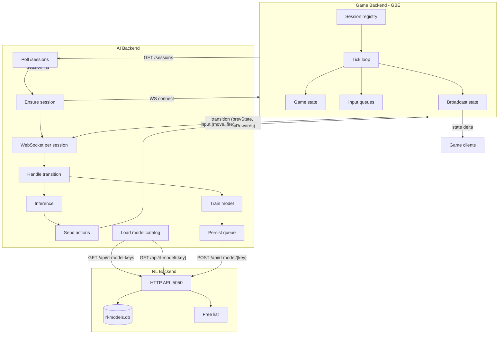
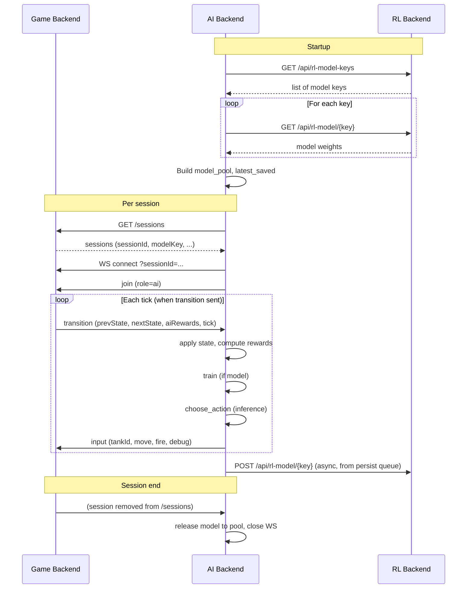

# GBE, AI Backend, and RL Backend Flow

## Sequence (one AI session)

## Ports and protocols

| Component    | Port | Role |
|-------------|------|------|
| Game Backend (GBE) | 5051 | HTTP (sessions, create, join, input), WebSocket (state, transitions) |
| AI Backend         | -    | Client only: HTTP to GBE and RL; WebSocket client to GBE |
| RL Backend         | 5050 | HTTP only (model keys, load, save, allocate, release) |
